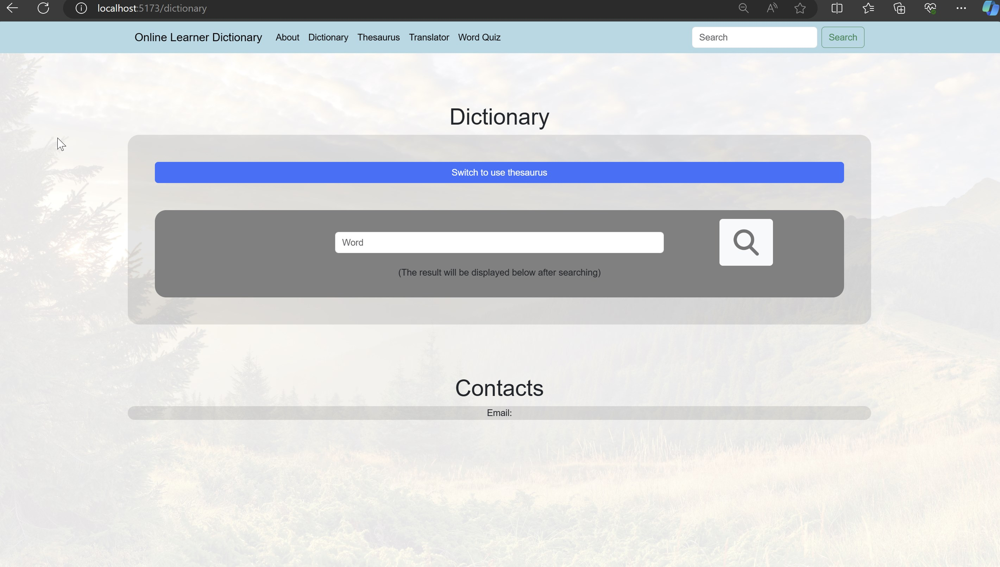
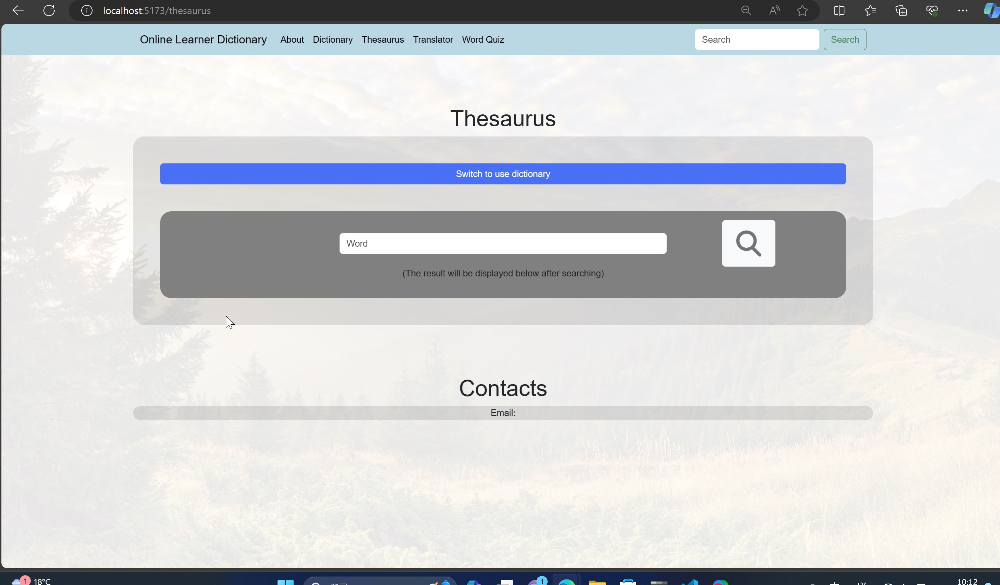

# Dictionary webapp (WIP)

A web application that provides general functions of a learner dictionary, such as:  

1. Dictionary 
2. Thesaurus 
3. Translator 
4. Word Quiz 

Word Quiz will ask questions about random vocabularies, mainly extracted from words in the search history stored in database
