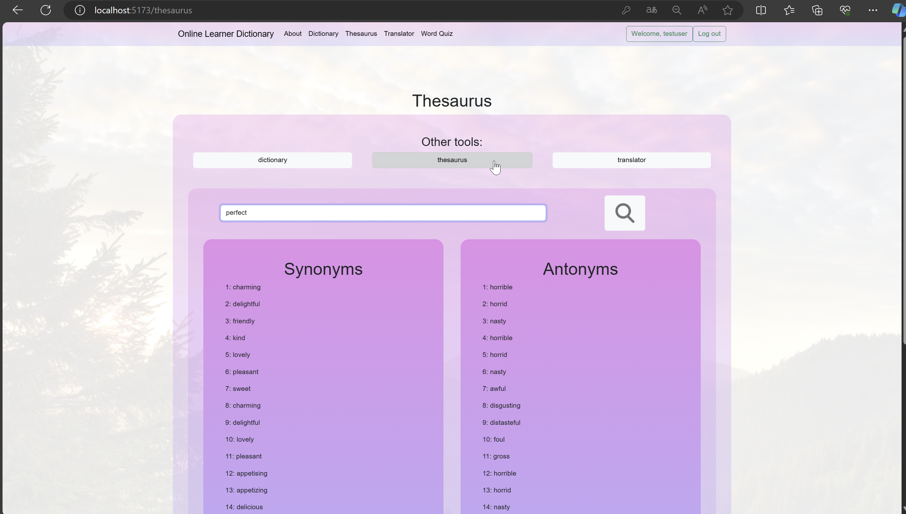

# Dictionary webapp

A web application that provides general functions of a learner dictionary, such as: (Previews are available, please scroll down) <br>

1. Dictionary<br>
2. Thesaurus<br>
3. Translator<br>
4. Word Quiz (WIP)<br>

Word Quiz will ask questions about random vocabularies, mainly extracted from words in the search history stored in database, maybe AI will be involved in creating questions (when I pay for openAI api)

## Steps to launch the website with docker:

1. get the docker image:

```
docker pull ngngka/dictionary-webapp-docker
```

Or you may go there: (https://hub.docker.com/repository/docker/ngngka/dictionary-webapp-docker/general)

### Step 2-3 can be skipped if you dont have a rapidAPI, but you still have to put something in .envexample and rename it to .env
2. go get a rapid api key from https://rapidapi.com , and put it in .envexample
3. subscribe to (https://rapidapi.com/andryerics/api/google-translation-unlimited)
4. Rename .envexample to .env
5. Run:

```
docker-compose up
```

6. Done, go to http://localhost:4173/ to access the web app

## Preview

### Home page


### Login page


### dictionary page (with result)


### thesaurus page (with result)



### translator page (with result)


